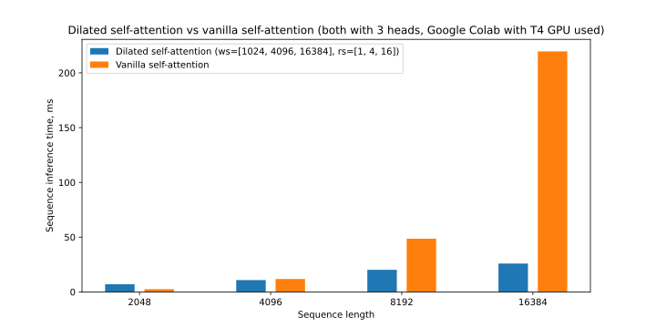
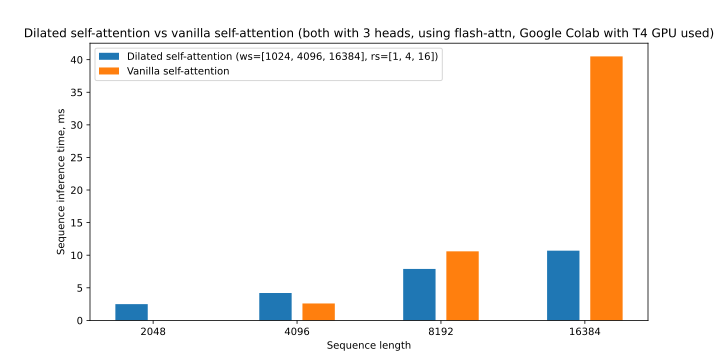

# Dilated Self Attention
This is an attempt to implement the dilated self attention as described in 
[LongNet: Scaling Transformers to 1,000,000,000 Tokens](https://arxiv.org/abs/2307.02486) by Jiayu Ding et al.

## Benchmark results



## Installation
### Basic
```shell
virtualenv -p python3.10 .venv
source .venv/bin/activate

# 2 steps below are optional, use to regenerate requirements.txt for your platform
pip install pip-tools
pip-compile

pip install -r requirements.txt
```

### Optimised self-attention implementation
After installing the basic dependencies you can install flash-attn module. 
To avoid long compilation time, a prebuilt wheel can be used:
```shell
pip install https://github.com/alexisrozhkov/flash-attn-wheels/raw/main/flash_attn-1.0.5-cp310-cp310-linux_x86_64.whl
```

## Usage
### Run tests
Example run confgurations:
```shell
# run tests that don't use flash-attn library
nose2 -A '!flash'

# run all tests
nose2
```

### Run benchmark
CLI interface:
```shell
usage: benchmark.py [-h] [--num_seq_lens NUM_SEQ_LENS] [--num_iter NUM_ITER] [--num_heads NUM_HEADS] [--emb_dim EMB_DIM] [--device DEVICE] [--flash FLASH] is_dilated max_seq_len

positional arguments:
  is_dilated            Whether to benchmark a dilated or vanilla self-attention
  max_seq_len           Maximum sequence length to benchmark

options:
  -h, --help            show this help message and exit
  --num_seq_lens NUM_SEQ_LENS
                        Number of sequence length to evaluate (each is 2x larger than the previous one) (default: 4)
  --num_iter NUM_ITER   Number of iterations to repeat the time measurement for (using new random input each time) (default: 200)
  --num_heads NUM_HEADS
                        Number of heads for multi-head self-attention (default: 3)
  --emb_dim EMB_DIM     Embedding dimensionality (default: 384)
  --device DEVICE       Device to put the model and input on (default: cuda:0)
  --flash FLASH         Whether to use optimised self-attention implementation from flash-attn (default: 0)
```

Example benchmark output (on Google Colab instance with T4 GPU):
```shell
> python benchmark.py 0 16384 --flash 0
8 x 2048:
2.5 ms
4 x 4096:
11.8 ms
2 x 8192:
48.6 ms
1 x 16384:
219.6 ms

> python benchmark.py 0 16384 --flash 1
8 x 2048:
0.0 ms
4 x 4096:
2.6 ms
2 x 8192:
10.6 ms
1 x 16384:
40.5 ms

> python benchmark.py 1 16384 --flash 0
8 x 2048:
7.0 ms
4 x 4096:
10.8 ms
2 x 8192:
20.2 ms
1 x 16384:
25.9 ms

> python benchmark.py 1 16384 --flash 1
8 x 2048:
2.5 ms
4 x 4096:
4.2 ms
2 x 8192:
7.9 ms
1 x 16384:
10.7 ms
```
Output format:
```shell
{batch size} x {sequence length}:
{sequence inference time}  
```


## To Do
- [x] Benchmarking code and reports for dilated self-attention vs vanilla one
- [x] Support different w to r ratios for multi-k attention
- [x] Support optimised self-attention implementation
- [ ] Add dropout(s)
- [ ] Distributed training using multiple GPUs handling parts of the sequence
- [ ] Make sure torch.compile works properly (currently I get NaNs at the first iteration of training)
